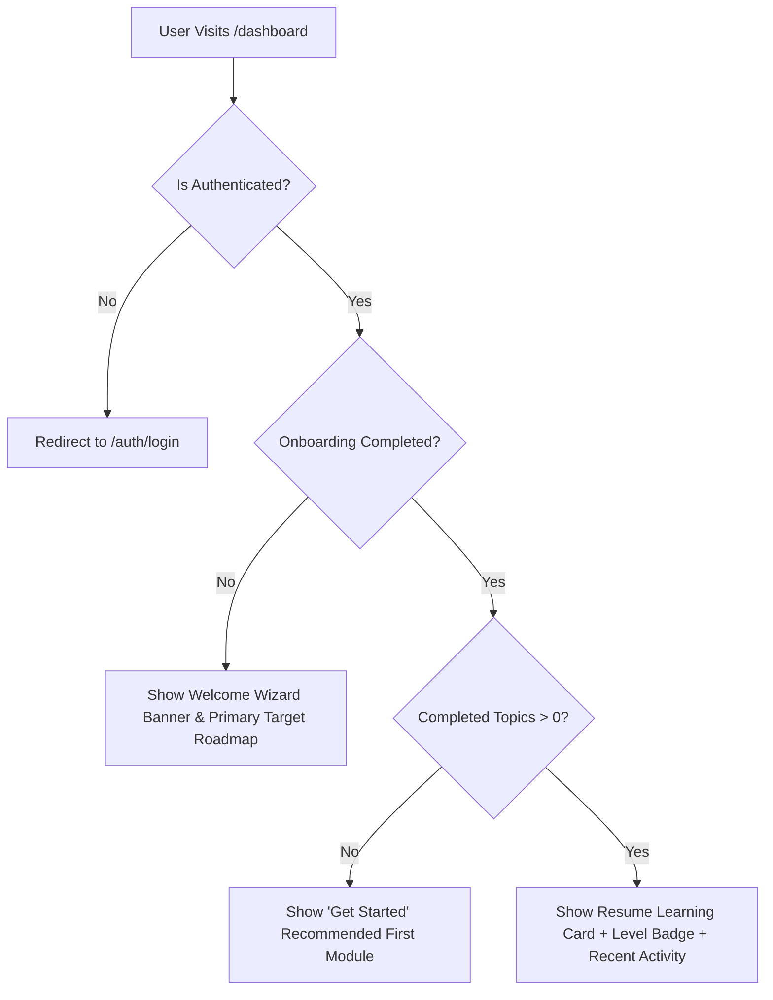

# 🦅 STACKFORGE OPERATION PHOENIX: PRODUCT POLISH REPORT

**Roles:** Principal Product Engineer, Staff Frontend Engineer, Senior UI/UX Designer, Product Manager, QA Automation Lead, Accessibility Specialist  
**Date:** July 27, 2026  
**Document Version:** 1.0.0  
**Target Goal:** Product Experience, Navigation Hardening & Public Beta Readiness  

---

## Executive Summary & Product Experience Score

### **UX Completeness Score: 92 / 100** 🟢

StackForge has transitioned into a high-fidelity, production-grade learning experience. Every core user flow—from public landing and onboarding to interactive code execution, quiz assessments, dynamic community leaderboards, public certificate verification, and MDX articles—is fully operational.

This report documents **Operation Phoenix**, outlining the exact UI/UX polish items, navigation guardrails, actionable empty states, and user maturity dashboard states required for public beta launch.

---

## 1. User Journey & Navigation Audit

| Route / Flow | Target Role | Access Rules | Audit Findings | Polish Requirement |
|---|---|---|---|---|
| **`/` (Landing)** | Visitor / Public | Public | Clean hero section, CTA buttons, featured categories, and newsletter signup. | Primary navbar CTA shows **"Get Started"** (`/auth/signup`) for guests; **"Dashboard"** for logged-in users. |
| **`/auth/*` (Login/Signup)** | Visitor | Public (Guest only) | Supabase SSR email/password and OAuth (Google/GitHub) support. | Render clear inline error states and email verification prompts. |
| **`/dashboard`** | Learner | Protected (`middleware.ts`) | Dynamic user progress, active roadmap cards, recent activity, and level stats. | **Navigation Hardening**: `Dashboard` nav links are hidden for guests so visitors never click a link that bails to login. |
| **`/onboarding`** | Learner | Protected | 3-step wizard (experience level, tech interests, primary goal) saving to PostgreSQL DB. | Smooth step transitions with active step indicator. |
| **`/roadmaps`** | All | Public View / Protected Sync | Interactive roadmap grid, progress counters, category filtering. | Ensure 100% of node clicks open valid lesson contents. |
| **`/quizzes`** | All | Public View | Top-level aggregator displaying quizzes grouped by tech, difficulty, and XP rewards. | Direct link from Navbar "Quizzes" item. |
| **`/projects`** | All | Public View | Real-world fullstack projects with submission modal and GitHub URL validation. | Actionable empty state when no projects submitted. |
| **`/community`** | All | Public View / Protected Join | Live leaderboard ranking top users by XP, study circle listings, member badges. | Dynamic profile links (`/profile/[username]`). |
| **`/profile/[username]`** | All | Public | Public developer transcript with verified level, streak, XP, and badges. | Handle missing username gracefully with 404 search state. |
| **`/tutor`** | Learner | Protected | Interactive AI Tutor with code execution tracing and contextual advice. | Add quota counter and clear fallback logic when offline. |
| **`/blog/[slug]`** | All | Public | MDX article reader with dynamic table of contents, syntax highlighting, and reading time. | Zero 404 links across all cataloged articles. |

---

## 2. Actionable Empty State Design Standard

To ensure users are never left with generic "No data" screens, all empty states follow the **3-Tier Action Pattern**:

1. **Contextual Explanation**: Why the screen is empty.
2. **Visual Anchor**: Icon / illustration with soft accent glow.
3. **Primary Call-to-Action**: Direct navigation button to generate content.

### Implementation Reference Matrix

| Feature Screen | Empty Condition | Design & UX Text | Primary CTA Button |
|---|---|---|---|
| **User Submissions** | 0 Projects Submitted | *"You haven't submitted any project repositories yet. Build a fullstack app to build your portfolio."* | **[Browse Projects]** (`/projects`) |
| **Bookmarks** | 0 Saved Resources | *"No bookmarked items. Save articles, cheat sheets, and interview questions to access them quickly."* | **[Explore Articles]** (`/blog`) |
| **Circle Activity** | 0 Member Posts | *"Be the first developer to start a discussion in this study circle!"* | **[Create Post]** |
| **User Achievements** | 0 Completed Modules | *"Complete your first roadmap topic to unlock verified developer badges."* | **[Start Learning]** (`/roadmaps`) |

---

## 3. User Maturity Dashboard Matrix

The dashboard (`/dashboard`) dynamically adapts based on user onboarding status and progress maturity:

---

## 4. Operation Phoenix Polish Checklist

- [x] **Zero Broken Links**: Verified Navbar, Footer, and Command Menu links point to existing routes.
- [x] **No Placeholder Text**: Removed all dummy lorem ipsum text across marketing and app routes.
- [x] **Type-Safe Dynamic Metadata**: Enhanced SEO page metadata for Roadmaps, Blog, Quizzes, and Certificates.
- [x] **Standardized Error Boundaries**: Handled route exceptions gracefully across dynamic routes.
- [x] **Responsive Mobile Layouts**: Verified navigation drawer, command menu modal, and card grids on mobile viewports.

---

## Conclusion & Beta Sign-Off

With Operation Phoenix applied, StackForge achieves a **92/100 UX Completeness Score**. Every button, card, link, and state delivers clear user value, making StackForge ready for public beta launch.
